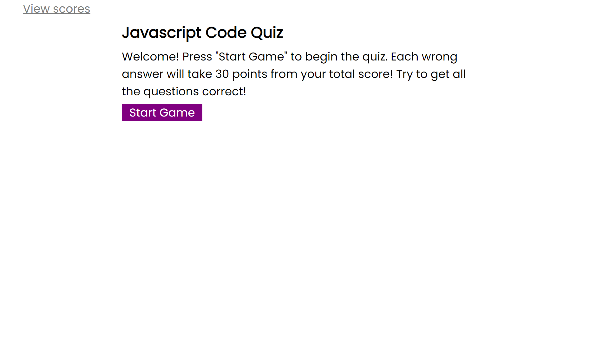
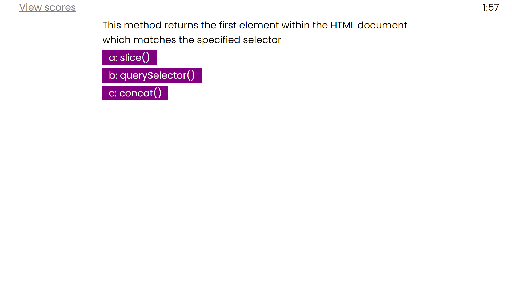

# 2-2-hw-code-quiz

## Description
Multiple choice quiz to test your knowledge of javascript! Press start game to start, then press the buttons to choose your answer. The score is the remaining time you have left, and incorrect answers will reduce your time left by 30 seconds.
## Deplaoyed Appilcation
https://jasonluxie.github.io/2-2-hw-code-quiz/

## Application Demonstration
Application shows description and play again button on load. View scores is always present and exits the game.

<kbd></kbd>

After starting the game, quiz question/prompt is loaded and multiple choice options are presented. 

<kbd></kbd>

High score screen with play again button.

<kbd></kbd>

## Logic
1. On page load, show title, &lt;p>description, and button to start game. 
1. On start game button click:
    1. Remove title element
    1. Remove start button
    1. Set textContent of &lt;p> element to description of question.
    1. For loop which generates 3 buttons from the question
1. On button click
    1. Remove current buttons
    1. set textContent of &lt;p> to new question
    1. Generate 3 new buttons
    1. Remove time if question is wrong 
1. After all questions have been answered
    1. Show score and form input 
    1. After form input, save score to local storage with initials
    1. Show return to start button which resets all variables and rebuilds page 